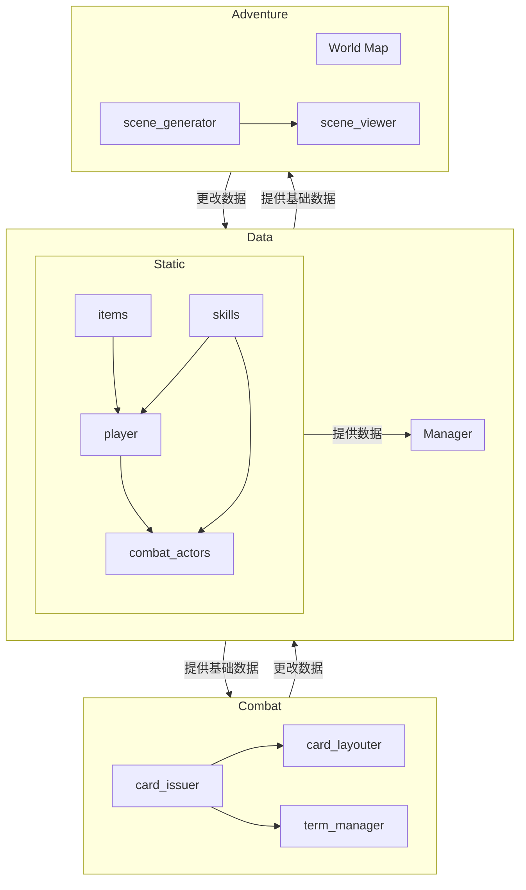

```mermaid
flowchart TD
	subgraph Data
		subgraph Static
            player
            combat_actors
            items
            skills
            
            player --> combat_actors
            items --> player
            skills --> player & combat_actors
		end
		subgraph Manager
		end
		Static -- 提供数据 --> Manager
	end
	subgraph Combat
		card_issuer
		card_layouter
		term_manager
		
		card_issuer --> card_layouter & term_manager
	end
	subgraph Adventure
		scene_generator-->scene_viewer
		subgraph World Map
		end
	end
	Data -- 提供基础数据 --> Combat & Adventure
	Combat & Adventure -- 更改数据 --> Data
```

